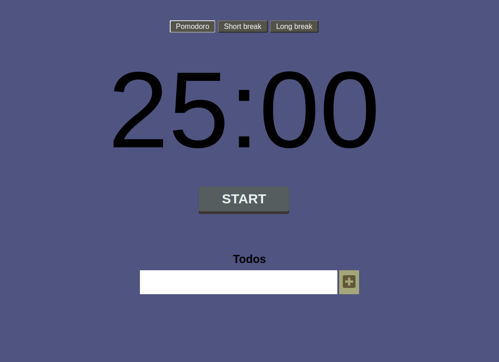

# Pomofocus

> a simple website allows the user to add , check and remove todos and check three different modes(timers) for work `25 mins` , short break `5 mins` and long break `15 mins`
## Table of contents
* [General info](#general-info)
* [Screenshots](#screenshots)
* [Technologies](#technologies)
* [Setup](#setup)
* [Features](#features)
* [Status](#status)
* [Inspiration](#inspiration)
* [Contact](#contact)

## General info

the Website is reverse engineering of `Pomodoro`, the objective is use `classes` , `setTimeOut` and `setInterval` methods in `Javascript`

## Screenshots


## Technologies
* JavaScript
* HTML
* CSS
* VSC code


## Setup
open the website and create as many `classes as you want`

## Code Examples

```js
'use strict';

import { logger } from '../../lib/logger.js';

import { Timer } from '../classes/list.js';


export const instance = new Timer();  

export function handleMain(){
  const buttonSound = new Audio('../../public/assets/click.mp3');
  buttonSound.play();
  const { action } = document.getElementById('js-btn').dataset;
  if (action === 'start') {
    instance.startTimer();
  } else {
    instance.stopTimer();
  }

  logger.push({
    userAction: 'action', 
    action,  
  });
}
  

```


## Features
List of features ready and Todos for future development

* 
* 
* 

To-do list:

* 
* 

## Status
Project is: _in progress_

## Inspiration


## Contact
By [@samirm00] 
