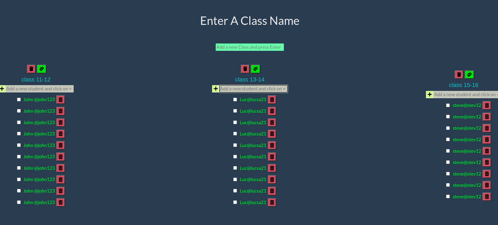

# Pomofocus


> 

## Table of contents
* [General info](#general-info)
* [Screenshots](#screenshots)
* [Technologies](#technologies)
* [Setup](#setup)
* [Features](#features)
* [Status](#status)
* [Inspiration](#inspiration)
* [Contact](#contact)

## General info

## Screenshots


## Technologies
* JavaScript
* HTML
* CSS
* VSC code


## Setup
open the website and create as many `classes as you want`

## Code Examples

```js

  

```


## Features
List of features ready and Todos for future development

* 
* 
* 

To-do list:

* 
* 

## Status
Project is: _in progress_

## Inspiration


## Contact
By [@samirm00] 
