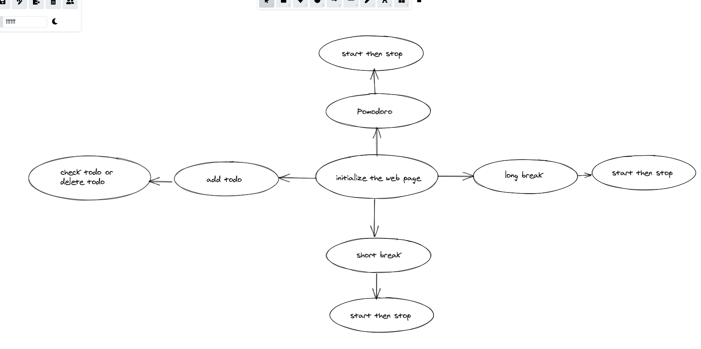
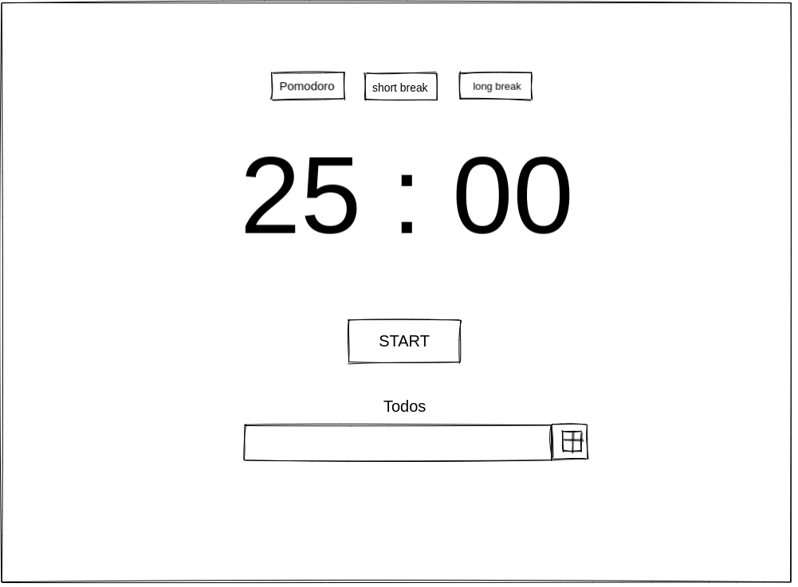

# Pomofocus
---

## Data

> describe the data used in your project.
>
> - what properties?
> - what types?
> - what are array entries like?

Data (timer) is an object with different properties.

---

## User Story Dependencies

---

## WIREFRAME

---

## 0.Setup

- clone the template repo `starter-classes`
- turn on GitHub pages.
- write the first strategy plan.
- Design a simple wireframe to set guidelines for UI/UX design.
- a simple `README.md`
---

## 1. Initialize the website

__As a user I want to use `pomodoro` for my `todos`when I load the site__

**When I open the website , I see:**
- an ultraviolet background color.
- three `button`in the top `pomodoro` , `short break` and `long break ` all have grey background
- I see abig digtal Timer `25:00` with white color.
- I see a `start` button with white color and grey background .
- I see a `header` todos and `input` with a `button shape + ` 

### REPO

- This user story is developed on branch `1-initialize`.
- This branch is merged to `master` branch after completion.

### Task A
`index.html` :
- add `progress` bar with `id` and `value = 0`.
- add `div` with class `progress-bar`. 
- add `div` with class `timer`. 
- add `div` with id `js-mode-button`.
- add three`button` with `date-mode` classes`button active mode-button`.
- add `div` with class `clock` and id `js-clock`.
- add `span` with id `js-minutes`.
- add `span` with class `separator`.
- add `span` with id `js-seconds`.
- add `button` with `date-action` , class `main-button` and id `js-btn`
- add `div` with class `hidden`.
- add 3 `audio`.
- add `div` with class `todos`.
- add `h3` with title `Todos`.
- add `form` with `input` and `button`.
- add `div` with class `todo-conatiner`.
- add `ul` with class `todo-list`.
### Task B
`style.css` :
- `html`: add box-sizing and border-box.
- `:root`: add three variables `--pomodoro``--shortBreak``--longBreak`.
- `body`: background color = `--pomodoro` , font family , transition to the background color
- `progress`: add border-radius , width , height and fix the position.
- `timer class`: position , top , left , transform , padding and center.
- `clock-class`: marign , font-size , display flex .
- `mode-button class`: font-size , height , cursor, box-shadow , padding, background.
- `main-button .active`:transform .

## 2. class 
__As a developer  I want to create a class  `Timer` for my `data` and `methods`__

### REPO

- This user story is developed on branch `2-class`.
- This branch is merged to `master` branch after completion.

### Task A
`list.js`:
- create class `Timer`.
- add data `timer`.
- add method`getRemainingTime` which calculated the remaining time and return it as an object
{total , minutes, seconds}.
- add method `startTimer` : 
  - calculate the endTime which is the current time + total time * 1000
  - if the mode = 'pomodoro' then increment `sessions`.
  - change `start` button to `stop` button.
  - use `setInterval` method with interval `1000ms`.
  - call `updateClock` method .
  - if `total` time is `<= 0` then `clearInterval`.
  - use `switch` statement to switch between the three different modes.
  -call `startTimer`.

- add method `stopTimer`:
  - clear the interval.
  - change `stop` button to `start` button again.

- add method `updateClock`:
  - get `minutes` and `seconds` from `remainingTime`.
  - add them to the DOM elements `js-minutes` and `js-seconds`.
  - add `title` to `document`.
  - add `progress` `max` attribute  value.

- add `switchMode` method:
  - this method takes on argument `mode`.
  - assign the data `mode`argument `mode`.
  - assign `remainingTime`.
  - select the three mode`buttons`, then remove class `active` from each of them.
  - update `background` according to them `mode`.
  - update `max` attribute of the `progress` bar.
  - call `updateClock` method.

## 3. start pomodoro
__As a user I want to choses `pomodoro`mode__

**When I choses `pomodoro`mode and click on start , I see:**
- the timer is starting
### REPO

- This user story is developed on branch `3-pomodoro`.
- This branch is merged to `master` branch after completion.
  
### Task A
`mainOne.js`:
- import `Timer` class .
- create `instance` object from the class.
- create `handler` `handleMain`.
  - create a new `Audio`.
  - play the `Audio`.
  - get `js-btn` dataSet.
  - if the `action` is `start` then call `startTimer` method.
  - if the `action` is `stop` then call `stopTimer` method.
  - push `data` to `logger` function.

  ### Task B
`listenerOne.js`:
- import `handleMain` form `handlers/mainOne.js`.
- select `js-button` and add event listener.

## 4. change the mode
__As a user I want to change the `mode`__

**When I click on `short break` or `long break` , I see:**
- the timers value change.
- bthe background changes
### REPO

- This user story is developed on branch `4-mode`.
- This branch is merged to `master` branch after completion.

### Task A
`mainSecond.js`:
- import `instance` object .
- create `handler` `handleMode`.
  - get `mode` form `event` argument.
  - if `mode` doesn't existed exit.
  - else call `switchMode` and `stopTimer`.
  - push `data` to `logger` function.

### Task B
`listenerTwo.js`:
- import `handleMode` form `handlers/mainThree.js`.
- select `js-mode-buttons` and add event listener.

## 5. display notification
__As a user I want to see the `notification`__

**When I accept the notification I see:**
- the notifications with message display .

### REPO

- This user story is developed on branch `5-notifications`.
- This branch is merged to `master` branch after completion.

### Task A
`mainThird.js`:
- import `instance` object .
- id `Notification` not `granted`or `denied` then
- ask for `Permission` then if  `Permission` granted create a new `Notification`.
- call `switchMode` method.

### Task B
`listenerThree.js`:
- import `notification` form `handlers/mainTwo.js`.
- select `document` and add event listener.

## 6. add todos 
__As a user I want to add todos`__

**When I add todo and click on the button I see:**
- todo added to my list .

### REPO

- This user story is developed on branch `6-todos`.
- This branch is merged to `master` branch after completion.
### Task A
`mainForth.js`:
- create a `handler` `addTodo`.
- create a new `div`.
- create a new `li` add `innerHTML` and class `todo-item`.
- append `li` to `div` element.
- create `completedButton`  add innerHTML and class `complete-btn`.
- create `deleteButton`  add innerHTML and class `delete-btn`.
- append both `button` to `div` element.
- add `div` element to `todo-list` on `HTML`.
- push `event` to `logger` function.

### Task B
`listenerFour.js`:
- import `addTodo` form `handlers/mainFour.js`.
- select `todo-button` and add event listener.

## 7. check or delete todos
__As a user I want to check todos and remove todos`__

**When I check or delete todos I see:**
- todo has been checked , the opacity changes.
- to do has been deleted.

### REPO

- This user story is developed on branch `7-checkOrDelete`.
- This branch is merged to `master` branch after completion.

### Task A
`mainFifth.js`:
- create a `handler` `deleteCheck`.
- if `event.target` has class `delete-btn` then add class `fall` and remove its parent.
- if `event.target` has class `complete-btn` then `toggle` class `completed`.
- push `event.target` to `logger` function.
### Task B
`listenerFive.js`:
- import `deleteCheck` form `handlers/mainFive.js`.
- select `todo-list` and add event listener.

### Task C 
`style.css`:
- `todo`: margin , background-color , color, font-size , display flex, transition.
- `complete-btn`: background-color , color, padding, border , cursor and font-size.
- `delete-btn`: background-color , color, padding, border , cursor and font-size.
- `completed class` : text-decoration and opacity.
- `fall class`: transform and opacity.
- `hidden`: display = none . 
- `todos` : add fix position , top , left and center. 
- `form input ` : color, background color , cursor and transition.
- `form button:hover` add background and color.
- `todo-ul`:  display flex , list-style none.

## 8.init

### REPO

- This user story is developed on branch `8-init`.
- This branch is merged to `master` branch after completion.
### Task 6 
`index.js`:
import all listeners.

---
